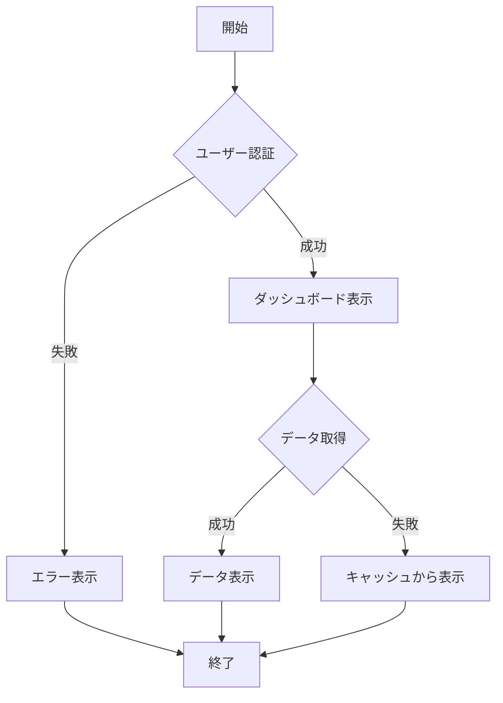
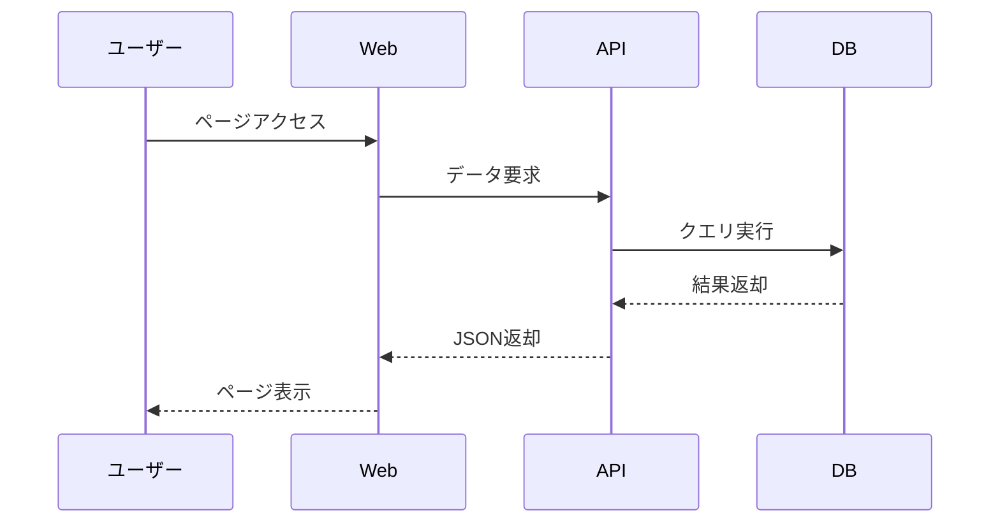
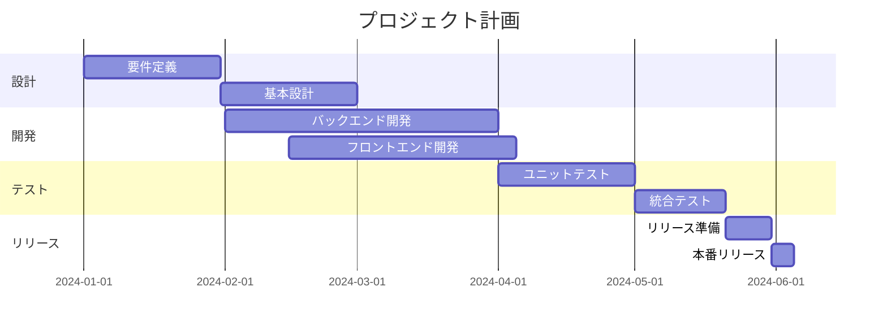
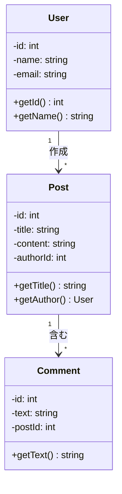
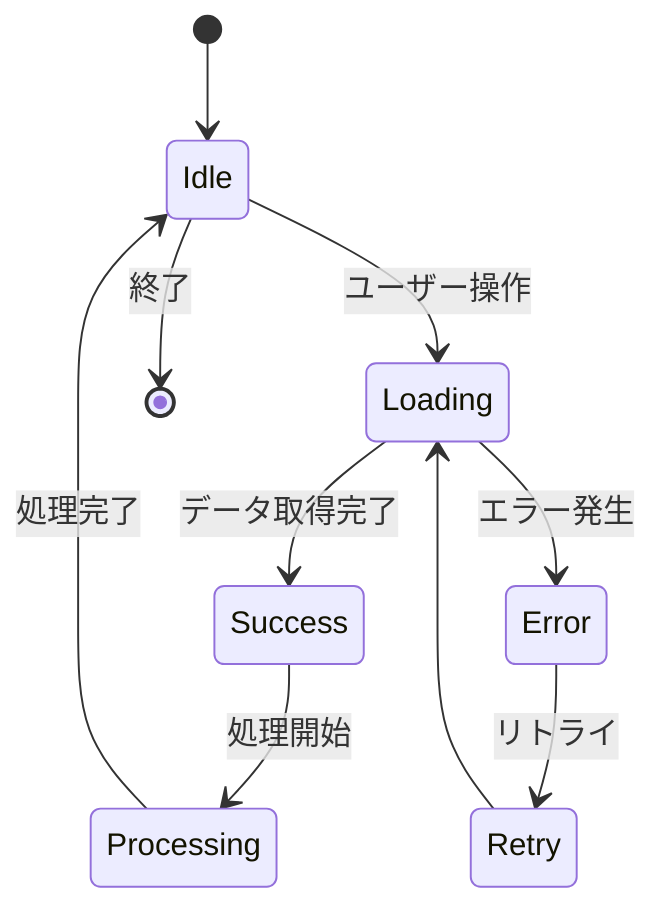
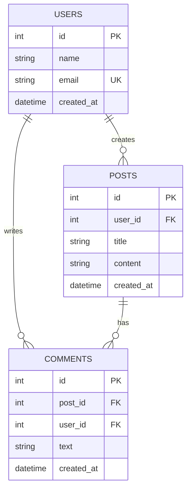
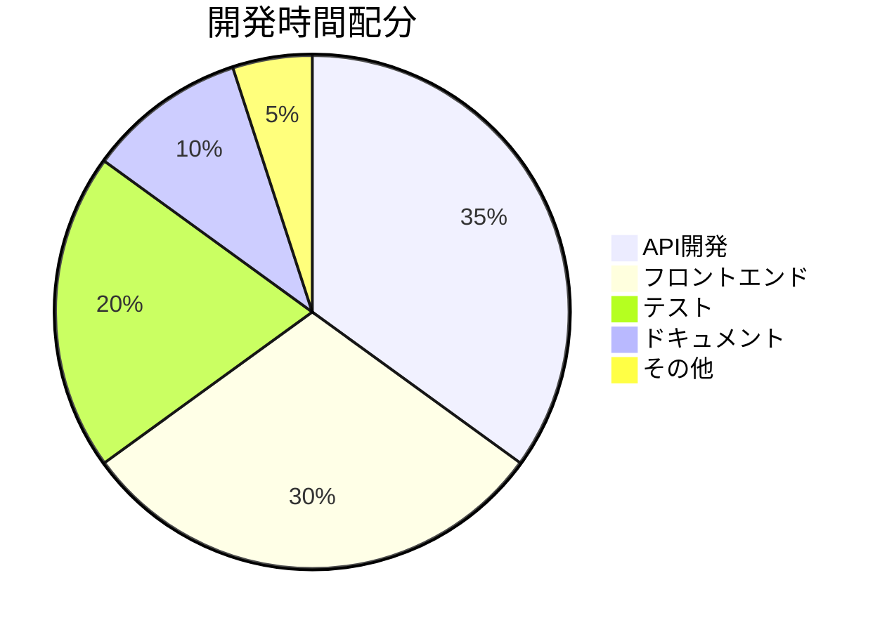
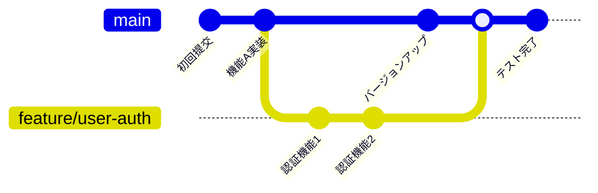
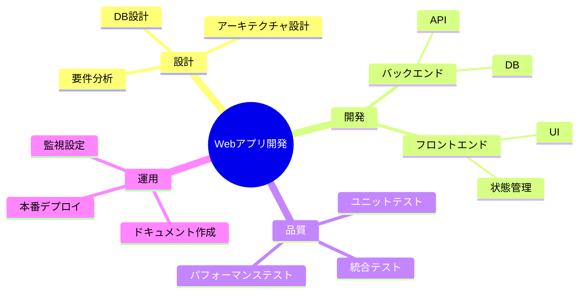

# Mermaidダイアグラムデモ

MkDocsのMermaidプラグインを使用して、様々な図表を作成できます。以下は代表的な例です。

## フローチャート

システムの処理フロー:

## シーケンス図

ユーザーとシステムの相互作用:

## ガントチャート

プロジェクトスケジュール:

## クラス図

オブジェクト指向設計:

## 状態図

アプリケーションの状態遷移:

## ER図

データベース設計:

## パイチャート

機能別の開発時間配分:

## ビットマップガントチャート

複数プロジェクトの管理:

## マインドマップ

プロジェクト計画の俯瞰:

## 利点

Mermaidプラグインを使用することで：

- **コード化**: 図表をマークダウンで管理できます
- **バージョン管理**: Gitで変更履歴を追跡できます
- **保守性**: 図表の修正が容易です
- **一貫性**: スタイルが統一されます
- **共有性**: ドキュメントに直接埋め込めます

詳細は[Mermaid公式サイト](https://mermaid.js.org/)を参照してください。
